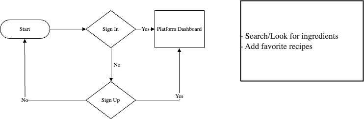
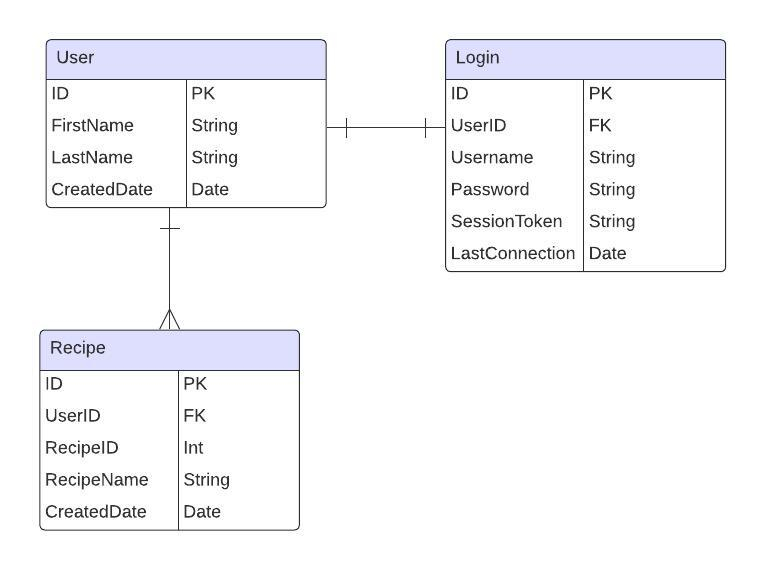

# Group4-TeamGinyu

## Project Proposal: HelpMeCook
Our project aims to create a user-friendly platform where users can manage their culinary experiences called. Users will have the ability to create an account, log in, search recipes by ingredients, and save recipes. By leveraging the Spoonacular API, we will provide a comprehensive database of ingredients and recipes to enhance user experience.

## MVP Features

1.	User Authentication:
    - Users will be able to create an account or log in.
    - Secure authentication mechanism to ensure user data privacy.
2.	Search Recipe By Ingredient:
    - Users can search recipes by typing or selecting ingredients using the Spoonacular API.
    - Display search results in a user-friendly format.
3.	Recipe Management:
    - Users can save recipes to their account.
4.	Recipe Discovery:
    - Users can search for and view recipes created by other users based on selected ingredients.

## ERD (Entity-Relationship Diagram)
The following tables will be used in the database:
1.	User:
    - ID (Primary Key)
    - FirstName
    - LastName
    - CreatedDate
2.	Login:
    - ID (Primary Key)
    - UserID (Foreign Key referencing User table)
    - Username
    - Password
    - SessionToken**
    - LastConnectionDate
3.	Recipe:
    - ID (Primary Key)
    - UserID (Foreign Key referencing User table)
    - RecipeName
    - RecipeID
    - CreatedDate

## External API

We plan on using the Spoonacular API to retrieve ingredient information and recipe data. The Spoonacular API provides a rich database of culinary information that will enhance the functionality of our application.
API URL: https://spoonacular.com

## Stretch Goals

1.	Ingredient Management:
    - Users can add new ingredients to the database.
2.	Recipe Import:
    - Users can import recipes from external sources.
3.	Custom Recipe Creation:
    - Users can create their own recipes and persist them in the database.

## Conclusion

This project will provide a comprehensive platform for users to manage and explore culinary recipes and ingredients. By implementing the MVP features and aiming for the stretch goals, we aim to create a valuable tool for cooking enthusiasts. The use of the Spoonacular API will significantly enhance the functionality and user experience of the application.